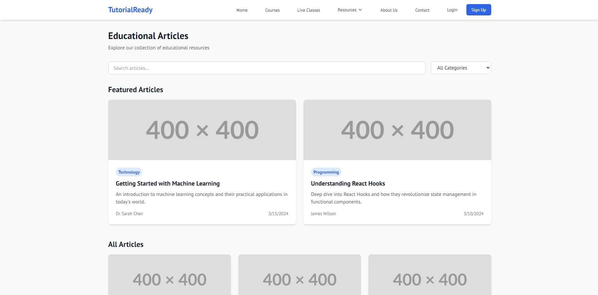

# TutorialReady

**TutorialReady** is an online learning platform designed to provide students, instructors, and other users with access to high-quality educational content, live classes, and a community for collaborative learning. This project is a robust and user-friendly platform that facilitates seamless course management, resource sharing, and real-time communication between users.

This project is built for a client and is licensed under the **GNU Affero General Public License v3.0 (AGPL)**, ensuring that all modifications and improvements made to the platform must also be shared under the same license when distributed.

## Features

### 1. Main Website

- **Home Page**: Provides an overview of the platform, featured courses, live classes, testimonials, and a call-to-action for users to sign up and browse courses.
- **Courses Page**: Displays a list of available courses with search and filter functionality, allowing users to browse courses by category, level, and more.
- **Course Detail Page**: Offers detailed information about each course, including syllabus, instructor profile, user reviews, and recommendations for related courses.

### 2. Live Classes

- **Live Classes Page**: Lists upcoming live classes with details such as date, time, instructor, and a registration option.
- **Calendar Integration**: Users can easily schedule live classes using calendar integration.

### 3. Resources

- **Resources Page**: Provides a section for downloadable resources such as worksheets and eBooks, with search and category filters for easier navigation.

### 4. Articles

- **Articles Page**: A section dedicated to educational articles, allowing users to explore articles by tags, categories, and featured content.
- **Single Article Page**: Displays the full article content along with author information, a comment section, and related articles.

### 5. Additional Pages

- **About Us Page**: Shares the platform's mission, team information, and affiliations.
- **Contact Us Page**: A contact form for inquiries, along with support information and a FAQ section.
- **Sign Up Page**: Allows users to register with role-based access (student, guardian, instructor, etc.), and includes email validation and confirmation.
- **Login Page**: Facilitates user authentication with password recovery options.

## Screenshots

Here are some screenshots of the platform:

### Home Page

### Courses Page

### Course Details Page

### Articles Page

### Articles Details Page

## License

This project is licensed under the **GNU Affero General Public License v3.0 (AGPL)**. Please refer to the `LICENSE` file for detailed information.

## Note

This platform is part of a project developed for a client, and all contributions and improvements made to the codebase must adhere to the conditions outlined in the AGPL license.
